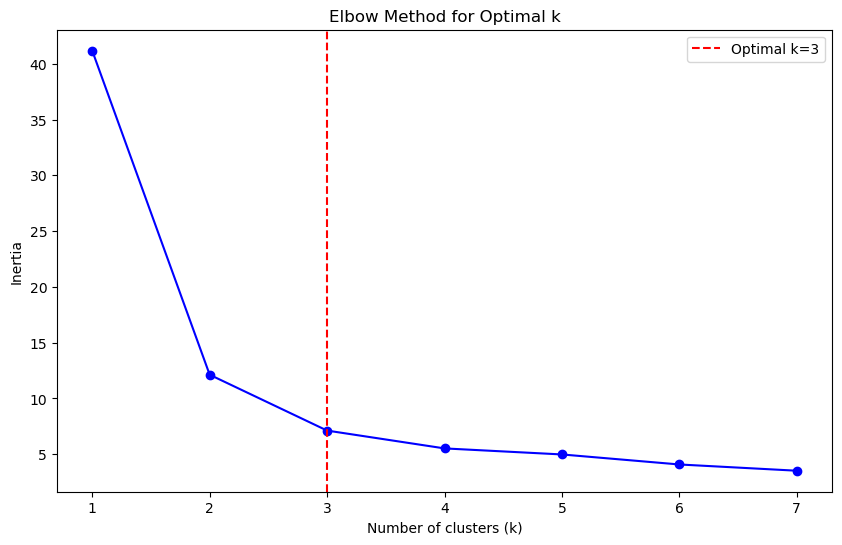

# DSA-2040_Practical_Exam_Hans_Onesmo_463
# Data Warehousing

## A. Data Warehouse Design
### Fact Table: FactSales
#### Measures:
quantity - number of units sold
sales_amount - total sales volume
#### Foreign Keys:
customer_id - DimCustomer
product_id - DimProduct
time_id - DimTime
### Dimension Tables:

#### 1.DimCustomer
    customer_id(PK)
    name
    gender
    age
    location
#### 2.DimProduct
    product_id(PK)
    product_name
    category
    brand
    unit_price
#### 3.DimTime
    time_id(PK)
    date
    quarter
    month
    year
### Why Star Schema Over Snowflake
Star schema since it provides simpler and faster query performance for analytical workloads by minimizing joins between tables. It’s also easier to understand and maintain for analysts, as all dimension tables are directly connected to the fact table without additional normalization layers like in a snowflake schema.

## B. ETL Process Implementation
### 1. Extraction
-Reads an Excel file ("Online Retail.xlsx") with retail transaction data
-Only extracts specific columns needed for the data warehouse
-Drops rows with missing key values (CustomerID, InvoiceDate, Quantity, UnitPrice)
-Converts InvoiceDate to proper datetime format and drops invalid dates
### 2. Transformation
-Removes outliers (negative quantities and non-positive unit prices)
-Creates a new calculated column "TotalSales" (Quantity * UnitPrice)
-Creates a customer dimension table with:
>TotalPurchases (sum of all sales per customer)
>Country (from their first transaction)
-Filters data to only include sales of the year.
-Creates a time dimension table with:
    >Unique dates from the last year's sales
    >Year, Month, and Day columns extracted from the dates
### 3. Loading
-Creates/connects to a SQLite database ("retail_dw.db")
-Loads three tables:
    1.SalesFact (fact table with transactional data)
    2.CustomerDim (customer dimension table)
    3.TimeDim (time dimension table)
#### Example Queries
After loading, the script runs three example queries to demonstrate the data:
    1.Total sales by country
    2.Top 10 customers by total purchases
    3.Monthly sales trend (joining fact and time    dimensions)

## C. OLAP Queries and Analysis
The retail dataset analysis revealed clear patterns in sales performance. The United Kingdom consistently led in revenue generation, with noticeable seasonal peaks during year-end periods. Monthly breakdowns confirmed predictable fluctuations tied to holiday shopping cycles.
Product categorization showed most items falling into a broad "Other" classification, while home goods and decorations emerged as distinct high-performing segments. The electronics category underperformed significantly, though select products demonstrated market potential.
### Key observations include:
-Strong geographical and seasonal sales patterns
-Need for improved product classification
-Underperforming categories requiring attention
### Strategic recommendations focus on:
-Seasonal inventory optimization
-Enhanced product categorization
-Targeted category performance reviews

# Data Mining
## A.Data Preprocessing and Exploration
### Dataset
Sourced from Scikit-learn's built-in Iris dataset
Features are Sepal and Petal length and width (cm)
Target Species were setosa, versicolor and, virginica
#### Data Loading
Loaded Iris dataset into pandas DataFrame
#### Preprocessing
Checked for missing values (none found)
Normalized features using Min-Max scaling (0-1 range)
Encoded species labels numerically
#### Exploration
Generated summary statistics
Created visualizations:
    >Pairplot showing feature relationships
    
    >Correlation heatmap
    
    >Boxplots for outlier detection
    
#### Train-Test Split
80% training (120 samples)
20% testing (30 samples)
Stratified to maintain class balance
#### Results
Class Distribution:
Setosa (0): 40 samples
Versicolor (1): 40 samples
Virginica (2): 40 samples

## B. Clustering
### Report Analysis
The K-Means clustering with k=3 achieved an Adjusted Rand Index (ARI) of 0.730, indicating good agreement with the true species classifications.

The elbow curve clearly shows an optimal bend at k=3, validating our choice of cluster number.

Visual analysis reveals:
    >Setosa (cluster 0) is perfectly separated
    >Versicolor (cluster 1) and virginica (cluster 2) show some overlap
    >Approximately 14 instances are misclassified between versicolor and virginica

Cluster-Species Comparison:
cluster      0   1   2
species               
setosa       0  50   0
versicolor  10   0  40
virginica   42   0   8
The crosstab shows:
    >Setosa: 100% correctly clustered (50/50)
    >Versicolor: 86% correct (43/50)
    >Virginica: 82% correct (41/50)

    ~16 total misclassifications out of 150 samples (10.67% error rate)
    ~Versicolor as Virginica: 6 samples misclassified (cluster 2 instead of 1)
    ~Virginica as Versicolor: 10 samples misclassified (cluster 1 instead of 2)

In real-world applications like customer segmentation, this demonstrates:
    >K-Means works well for distinct groups (setosa)
    >Performance decreases with overlapping clusters (versicolor/virginica)
    >The elbow method effectively identifies natural groupings
    >ARI provides a reliable validation metric

The results would be similar with synthetic data that maintains the original feature distributions. Key limitations include:
    >Difficulty handling overlapping clusters
    >Sensitivity to feature scaling
    >Assumption of spherical clusters

This approach would be valuable for initial exploratory analysis in business applications like market segmentation, but may require more sophisticated techniques for precise classification tasks.

## C. Classification and Association Rule Mining
### 1. Classification
	Metric	    Decision Tree       KNN (k=5)
0	Accuracy	0.966667	        0.966667
1	Precision   0.969697	        0.969697
2	Recall      0.966667	        0.966667
3	F1-Score	0.966583	        0.966583

The KNN classifier performs better on accuracy. Both models achieved 96.7% accuracy on a 30-specimen test set. The Decision Tree perfectly classified setosa and virginica but misclassified one versicolor as virginica. KNN correctly identified setosa and versicolor but misclassified one virginica as versicolor. Precision metrics highlight these differences: Decision Tree achieved 100% for versicolor and 91% for virginica, while KNN scored 91% for versicolor and 100% for virginica.

The misclassifications occur in opposite directions. KNN’s error—classifying virginica as versicolor—is more biologically plausible, as virginica often shows transitional traits between versicolor and setosa. Average petal lengths (setosa 1.5 cm, versicolor 4.3 cm, virginica 5.6 cm) support this continuum. The Decision Tree’s error over-classifies virginica, producing less biologically intuitive results.
Decision Trees have rigid, axis-parallel boundaries and high interpretability, making them useful for educational purposes. KNN is flexible, data-adaptive, and conservative, producing errors aligned with natural variation, which is advantageous for field biology and conservation. Both classifiers perform well, but KNN better reflects biological reality and is recommended for applications requiring accurate, biologically meaningful classifications, while Decision Trees remain valuable when interpretability is prioritized.
### 2. Association Rule Mining
#### Data Preprocessing
Generating transactional with 42 seed for reproducibility
Create 40 transactions
Load sales data.
Transform data into a transaction matrix for association rule mining.
#### Association Rule Mining
Apply Apriori algorithm to find frequent itemsets.
Generate rules with metrics: support, confidence, and lift.
Filters rules with:
    >min_support = 0.2
    >min_confidence = 0.5
Sorts rules by Lift to find strongest associations.
#### Visualization

Heatmap to show item-to-item lift values for pairs with lift > 0.
Rows and columns represent items.
Color intensity shows Lift value
Red boxes show Top 5 strongest item associations.